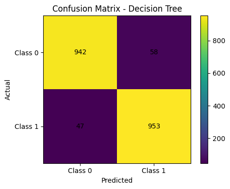
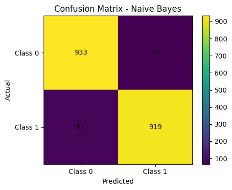
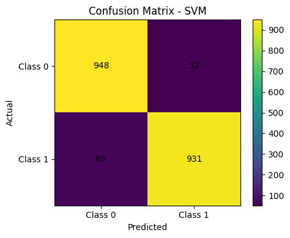

## Klasifikasi Buah Orange dan Grapefruit
## Muhammad Jalallullail - 1237050025

Tugas ini bertujuan membangun model klasifikasi untuk membedakan buah orange dan grapefruit
https://www.kaggle.com/datasets/joshmcadams/oranges-vs-grapefruit

## Dataset
Dataset berisi 10.000 data dengan 6 kolom:
- `name`
- `diameter`
- `weight`
- `red`
- `green`
- `blue`

Distribusi kelas:
- orange ada 5000 data
- grapefruit ada 5000 data

## Tahapan Pengerjaan

### Pertama
Dataset dianalisis terlebih dahulu untuk melihat struktur data, tipe fitur, dan distribusi kelas.

### Ke-2
Memisahkan fitur dan label, melakukan label encoding pada target, membagi data menjadi training dan testing

### Ke-3
Tiga model klasifikasi dibandingkan:
- Decision Tree
- Naive Bayes
- Support Vector Machine

### Ke-4
Evaluasi, dilakukan menggunakan:
- Accuracy
- Precision
- Recall
- F1-score
- Confusion Matrix
- Precision-Recall Curve
- ROC Curve

## Hasil Evaluasi
Dengan konfigurasi `train_test_split(test_size=0.2, random_state=42, stratify=y)`, hasil yang diperoleh adalah:

| Model | Accuracy | Precision | Recall | F1-score | ROC-AUC |
|---|---:|---:|---:|---:|---:|
| Decision Tree | 0.9475 | 0.9426 | 0.9530 | 0.9478 | 0.9475 |
| Naive Bayes | 0.9260 | 0.9320 | 0.9190 | 0.9255 | 0.9792 |
| SVM | 0.9395 | 0.9471 | 0.9310 | 0.9390 | 0.9773 |

## Hasil Confusion Matrix

Confusion Matrix - Decision Tree:



Decision Tree memiliki jumlah prediksi benar yang sangat tinggi pada kedua kelas. Kesalahan klasifikasi relatif kecil dan seimbang. Hal ini menunjukkan bahwa model mampu memisahkan data dengan baik, sesuai konsep Decision Tree yang memilih atribut terbaik berdasarkan information gain sehingga menghasilkan pemisahan yang optimal .

Kesimpulan:
Model ini paling stabil dan akurat untuk klasifikasi langsung.

Confusion Matrix - Naive Bayes:



Naive Bayes memiliki kesalahan yang lebih besar dibanding Decision Tree, terutama pada false negative (81). Ini berarti model cukup sering gagal mengenali kelas orange.

Kesimpulan:
Model ini cukup baik.

Confusion Matrix - SVM:



SVM memiliki performa yang seimbang dan cukup tinggi. Model ini bekerja dengan mencari hyperplane optimal yang memisahkan dua kelas dengan margin maksimum.

Kesalahan masih ada, tetapi lebih kecil dibanding Naive Bayes dan mendekati Decision Tree.

Kesimpulan:
Model ini stabil dan kuat, terutama untuk pemisahan kelas yang kompleks.

## Kesimpulan
Berdasarkan accuracy, Decision Tree menjadi model terbaik pada percobaan ini. Namun, Naive Bayes dan SVM menunjukkan ROC-AUC yang lebih tinggi, sehingga keduanya juga memiliki kemampuan pemisahan kelas yang sangat baik. Perbedaan ini terjadi karena accuracy hanya melihat hasil prediksi akhir, sedangkan ROC-AUC menilai kualitas probabilitas pemisahan kelas.

## Cara Menjalankan
1. Install library yang dibutuhkan.
2. Pastikan file dataset berada satu folder dengan script.
3. Jalankan:
```bash
python UTS-ML.py
```
